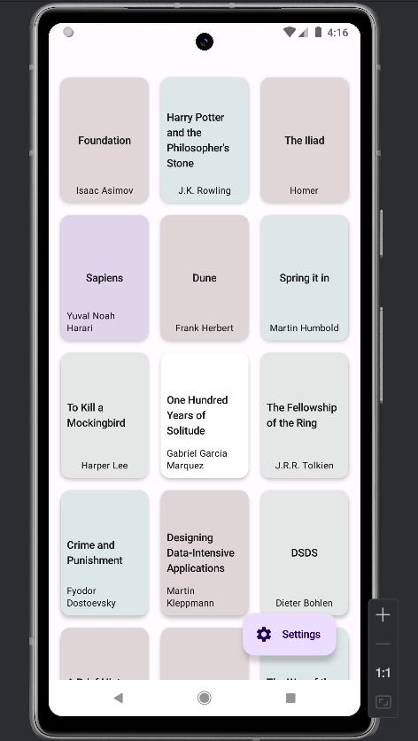

# Bookshelf App

A Android app built with Kotlin and Jetpack Compose that helps users manage and explore their book collection. The app features a clean, material design-based UI with support for both light and dark themes.

## Features

- **Book Grid View**: Display books in an aesthetically pleasing grid layout with pastel color cards
- **Detailed Book Information**: View comprehensive book details including:
  - Basic information (title, author)
  - Technical details (ISBN, publisher, year, etc.)
  - Book description
  - User reviews with star ratings
- **Settings Management**: 
  - Toggle dark/light theme
  - Enable/disable notifications
- **Material Design 3**: UI components and animations
- **Bottom Sheet Details**: Transitions for viewing book details
- **Responsive Layout**: Adapts to different screen sizes and orientations

## Screenshots

<div style="display: flex; flex-wrap: wrap; gap: 10px;">
    
    
    
    
</div>

## Tech Stack

- **Language**: Kotlin
- **UI Framework**: Jetpack Compose
- **Architecture**: MVVM (Model-View-ViewModel)
- **Network**: Retrofit
- **Asynchronous Programming**: Kotlin Coroutines & Flow
- **Material Design**: Material 3 Components

## Project Structure

```
com.example.bookshelf_frontend/
├── data/   
│   ├── BookRepository.kt
│   ├── DetailsRepository.kt   
│   ├── ReviewsRepository.kt     
│   ├── BookApi.kt
│   └── RetrofitClient.kt
├── model/
│   ├── Book.kt
│   ├── Details.kt
│   └── Reviews.kt
├── ui/
│   ├── screens/
│   │   ├── book/
│   │   │   ├── BookScreen.kt
│   │   │   └── BookViewModel.kt
│   │   └── settings/
│   │       ├── SettingsDrawer.kt
│   │       └── SettingsViewModel.kt
│   └── theme/
│       ├── Color.kt
│       ├── Theme.kt
│       └── Type.kt
└── MainActivity.kt
